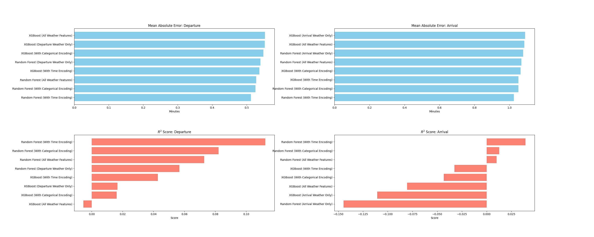

# Flight departure delay prediction model

App link: https://lescalable-frames.streamlit.app/

For the final project of the course Scalable Machine Learning and Deep Learning (HT25), we (Álvaro Mazcuñán Herreros and Jonas Lorenz) implemented a daily pipeline for the prediction of flight delays based on weather data at big European airports.

## Problem description

We tackled the hard problem of predicting flight delays. What makes the problem a tough one to tackle is the variety of reasons that can cause flight delays. There is plenty of stages in which delays can be introduced, like labor shortages, previous flights being delayed, weather conditions and rare events like medical emergencies. We focused on the data everyone has access to, namely weather (via the Open-Meteo API). To get a history of flights, we used the Aviation Edge API, which has the history of flights going back one year with departure delays and flight schedules. The list of airports we focused on are London Heathrow (LHR), Frankfurt (FRA), Amsterdam Shiphol (AMS), Copenhagen Airport (CPH), Charles de Gaulle Airport (CDG), Istanbul Airport (IST), Madrid Adolfo Suárez-Barajas (MAD), Barcelona-El Prat (BCN), Rome Fiuicino (FCO) and Munich Airport (MUC). After training plenty of models, we decided that our best shot at predicting meaningfully was to focus on departure delays, as arrival delays are usually lower since pilots can make up for delays by increasing speed and because planes, once in the air, cannot be kept in the air for ever just because of poor weather conditions at the arrival airport.

## Data and Features

### Data Sources
* **Flight Data:** Sourced via the [Aviation Edge API](https://aviation-edge.com/), including scheduled/actual times, airline IATA codes, and delay durations (in minutes).
* **Weather Data:** High-resolution hourly archives from [Open-Meteo](https://open-meteo.com/). Features are matched to flights by "flooring" the scheduled departure time to the nearest hour.

### Primary Features

#### Meteorological Features (Origin & Destination)
Weather is the primary driver of variance in this model. For every flight, we capture:

| Feature | Description |
| :--- | :--- |
| `temperature_2m` | Air temperature at 2 meters above ground. |
| `precipitation` | Combined rain, snow, and sleet (mm). |
| `wind_speed_10m` | Sustained wind speeds (km/h) at 10 meters. |
| `wind_gusts_10m` | Maximum instantaneous wind speed (km/h). |
| `pressure_msl` | Sea-level pressure (hPa), used to detect storm systems. |
| `cloudcover` | Total cloud cover percentage. |
| `weather_code` | WMO code representing specific conditions (e.g., fog, thunderstorm). |
| `wind_dir_cos`, `wind_dir_sin` | transformed wind direction | 

#### Cyclical Time Encoding
We transformed timestamps into circular coordinates using **Sine and Cosine** transformations. We used the times for both departure and arrival.

#### Spatial & Wind Encoding
* **Origin One-Hot Encoding:** Categorical variables for each hub airport to account for airport-specific ways of dealing with given weather conditions
* **Wind Direction Vectors:** Wind direction (0-360°) is decomposed into `wind_dir_sin` and `wind_dir_cos`. This prevents the model from seeing 359° and 1° as opposites, treating them instead as nearly identical northern winds.

### Data Pre-processing & Target
* **The Target ($y$):** We predict the **Natural Log** of the departure delay: $\log(1 + \text{delay})$. This "Log1p" transformation compresses extreme outliers and helps the regressor focus on the more common lower delay range. Moreover, the log-transform serves as a variance reducing transformation.
* **Delay Clipping:** Delays are clipped at **180 minutes** during training to prevent extreme technical delays (plane breakdowns) from skewing the model's understanding of weather-related delays.
* **Duplicate Handling:** The pipeline strictly enforces uniqueness of the flights to prevent data leakage.

### Feature Summary

| Group | Final Feature Count |
| :--- | :--- |
| **Airports** | 10 (One-Hot) |
| **Weather** | 10 (including 2 for wind direction)|
| **Time** | 4 (Cyclical) |

## Model training

To decide on a model and which features to use, we trained several models using Random Forest and XGBoost. The results of our experimentation can be seen below. Generally, we saw that adding time features was crucial for the model to have somewhat good explainability. Earlier flights, as well as later ones, have to compete with less flights to get to take off, leading to less congestion and thus impact of the weather features. The XGBoost model performed generally better with a lower amount of regressors (namely 10), whereas Random Forest improved as regressors increased. We conducted our experimentation on a smaller subset of airports, London, Frankfurt and Amsterdam, with flights going to Copenhagen. The idea here was to keep airports close for arrival weather to play a role in prediction. The final version of our project only focuses on departures, not restricting the destination, so we decided to drop arrival weather as features, given that the feature importance for arrival weather was generally low anyways. In the name of scalability, we trained only one model with one-hot encodings for the airports. The model we deployed has a lower R squared, but is able to make predictions for all the airports mentioned in the introduction. We guess that the good performance with a R squared of 0.1877 was only achievable since we focused on shorter flights within Europe, and also included arrival weather to provide a more holistic view of the weather conditions of the flight path. Another challenge we faced was that we only had one year of historical data. While the given prediction problem should be trained with a time series split, this means that the test data comes from a different season, likely meaning we test on data outside of the training distribution. Even when using a time series split, the models performed fairly well, with the 0.1877 model reaching a R squared value of about 0.13. 

Generally, we noticed that predicting flight delays based on weather is very hard, given simply that there are so many more factors that impact departure delays. This is also visible in the UI. Some flights with the same weather conditions and very close departure times can have vastly different delays. Weather is not at all indicative of the delay in those cases. Our model should thus be used with caution, and provides a solid baseline for measuring the potential impact of weather on flights, even if this impact is not always one that shows up in the departure delay.

## The UI

The UI shows delays and predicted delays. The delays are provided real-time by the Avation Edge API, but are not updated as often as they probably should.
